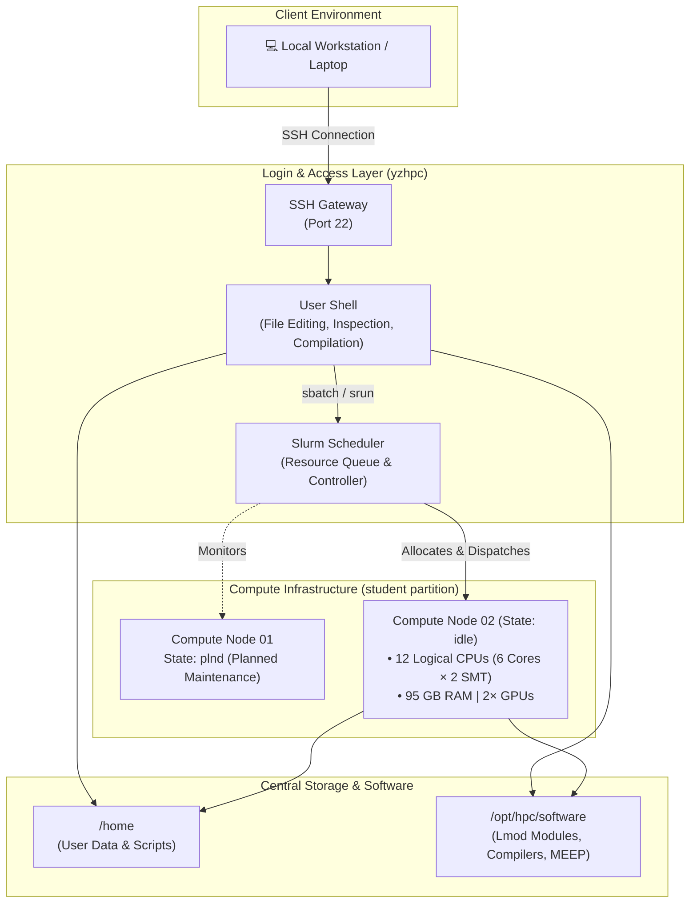
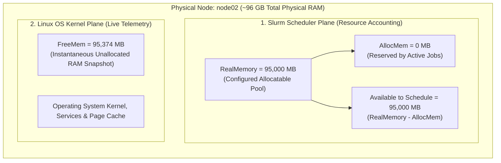
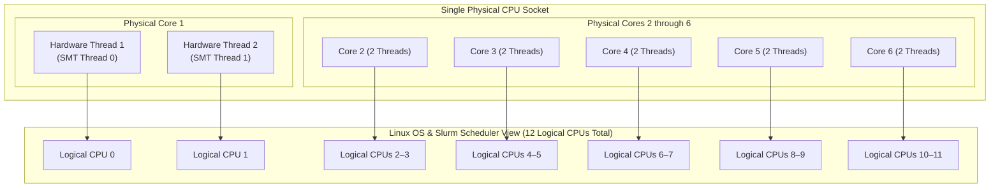
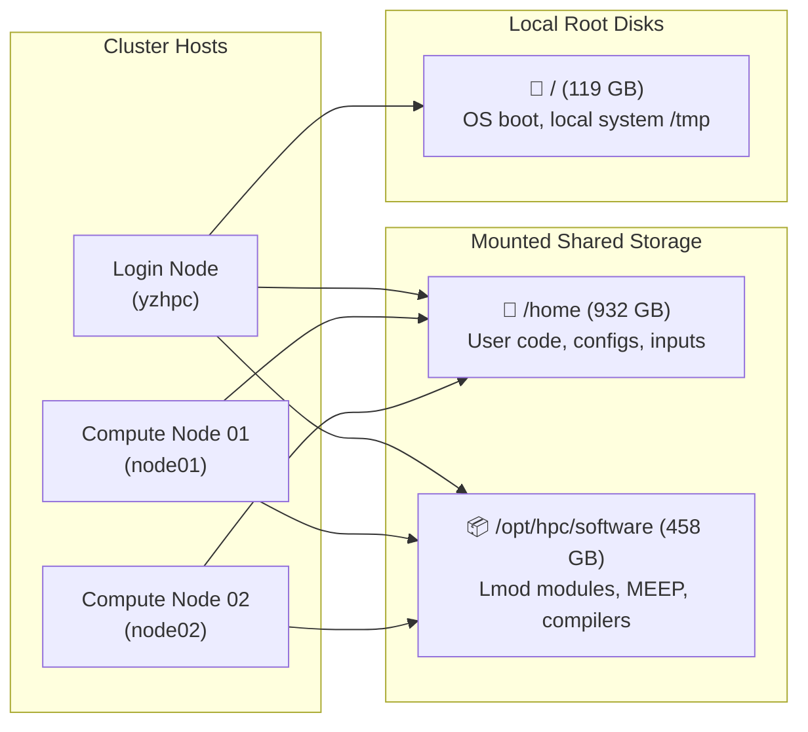
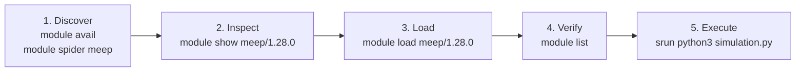
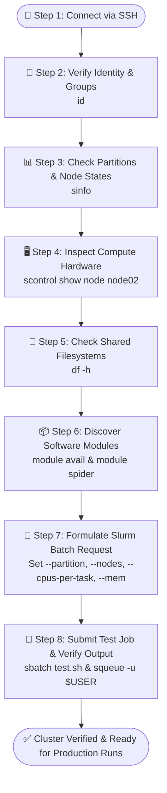



*This guide is Part 2 of the [HPC and MEEP series](/hpc/meep/).*

Before running an intensive simulation, take a few minutes to understand the cluster you have logged into. Check which machines are available, what hardware resources they provide, which Slurm partition can allocate them, and what software environment is installed.

This quick survey helps answer fundamental practical questions before writing a job script:
- Is a suitable compute node available?
- How much memory can safely be requested?
- Is MEEP installed and configured with MPI/GPU support?
- Which Python, compiler, and MPI modules should the job load?

> **Snapshot Note: YZ HPC Cluster Worked Example**
> This article uses real command output from the **YZ HPC cluster** as a worked example. Cluster status, free disk space, and software versions change over time, so treat the values below as a snapshot rather than a permanent guarantee. Always use your own cluster's documentation and live command output when planning real simulation runs.
{: .notice--info}

---

## 1. How the Pieces Fit Together

An HPC cluster typically separates user access, job scheduling, compute execution, and storage. 
1. **Login Node:** Where you connect via SSH to inspect the system, manage files, and prepare jobs.
2. **Slurm Scheduler:** The central coordinator that queues jobs and allocates compute nodes when resources are available.
3. **Compute Nodes:** Dedicated machines where resource-intensive simulations actually execute.
4. **Shared Storage & Modules:** Centralized filesystems mounted across nodes, supplying project data and modular software packages.



In our worked example:
- The **login host** reports an 8-CPU, 23-GiB machine.
- The **`student` partition** contains two compute nodes:
  - `node02` is currently `idle` with 12 logical CPUs, ~95 GB of configured memory, and 2 GPUs.
  - `node01` is reported with Slurm state `plnd` (planned). Because `plnd` is not the same as `idle`, check your cluster administrator's notices or documentation before assuming it is available.

---

## 2. Start with Your Account and Access

Run `id` to see your numeric user ID (UID), primary group ID (GID), and all supplementary group memberships:

```bash
id
```

**Example output** *(account name omitted for privacy)*:

```text
uid=2011(<user>) gid=2001(student) groups=2001(student)
```

### Why Account Groups Matter

| Field | Example Value | Role in HPC |
| :--- | :--- | :--- |
| **User ID (`uid`)** | `2011` | Unique numerical identifier for your user account on the Linux system. |
| **Primary Group (`gid`)** | `2001(student)` | Default ownership assigned to any new files or directories you create. |
| **Groups (`groups`)** | `2001(student)` | Determines access to specific Slurm partitions, restricted software modules, and shared lab directories. |

> **Security & Privacy Tip**
> Your group permissions directly affect access to files, software stacks, and scheduler partitions. Avoid publishing personal account identifiers or credentials in public articles, forum posts, or bug reports unless specifically required.
{: .notice--warning}

---

## 3. Ask Slurm What Is Available

Slurm provides several commands to inspect partitions, query queued jobs, and examine detailed compute node hardware configurations.

### 3.1 List Partitions and Node States (`sinfo`)

Use `sinfo` to view available partitions, wall-clock time limits, node counts, and operational node states:

```bash
sinfo
```

**Example snapshot:**

```text
PARTITION AVAIL  TIMELIMIT  NODES  STATE NODELIST
student      up   12:00:00      1   plnd node01
student      up   12:00:00      1   idle node02
```

#### Understanding the Output Fields

- **`PARTITION` (`student`):** The logical queue grouping compute resources.
- **`AVAIL` (`up`):** Shows whether the partition is accepting job submissions.
- **`TIMELIMIT` (`12:00:00`):** The maximum wall-clock time permitted for any single job in this partition (12 hours).
- **`NODES` & `NODELIST`:** Lists how many nodes currently reside in that specific state.
- **`STATE`:** Slurm operational status of the nodes.

#### Common Slurm Node States

| State | Status Meaning | Actionable Insight for Users |
| :--- | :--- | :--- |
| `idle` | Node is powered on, healthy, and has unallocated resources. | Ready immediately for new job allocations. |
| `alloc` | Node is fully allocated to one or more running jobs. | Jobs targeting this node will wait in queue until current runs finish. |
| `mix` | Node is partially allocated (some CPUs/memory used, some free). | Can accept smaller jobs if remaining resources fit. |
| `plnd` | Planned maintenance or future reservation set by administrators. | Not available for immediate general dispatch. |
| `down` / `drain` | Node is offline due to hardware issues or being emptied for service. | Slurm will not place new jobs here. |

> **State Code Caution**
> Slurm state codes can include suffix characters (such as `*`, `~`, `#`, or `$`) indicating dynamic power states or maintenance flags. Do not guess a state from its abbreviation alone; consult `man sinfo`, run `sinfo --long`, or check your site's status documentation.
{: .notice--warning}

---

### 3.2 Check Your Jobs (`squeue`)

Use `squeue` to view all active jobs across the cluster, or filter specifically for your own username:

```bash
# View all jobs in the cluster queue
squeue

# View only your submitted jobs
squeue -u "$USER"
```

An output containing only the column header line means there are no active jobs currently listed for that query:

```text
JOBID PARTITION     NAME     USER ST       TIME  NODES NODELIST(REASON)
```

> **Beginner Tip**
> An empty `squeue -u "$USER"` output only indicates that *your* account has no active or queued jobs. It does not mean the cluster is idle—other users may be running jobs across the partitions. Run `squeue` without flags to see the full cluster workload.
{: .notice--tip}

---

### 3.3 Inspect a Compute Node (`scontrol show node`)

For an exhaustive hardware breakdown of a specific compute node, run `scontrol show node`:

```bash
scontrol show node node02
```

The full output is extensive and updates dynamically as workloads shift. Below are the key configuration fields extracted from the `node02` snapshot:

```text
NodeName=node02 CoresPerSocket=6 ThreadsPerCore=2
CPUAlloc=0 CPUEfctv=12 CPUTot=12
Gres=gpu:2
RealMemory=95000 AllocMem=0
State=IDLE Partitions=student
CfgTRES=cpu=12,mem=95000M,billing=12
```

#### Key Node Parameters Explained

- **`CoresPerSocket=6` & `ThreadsPerCore=2`:** 1 physical CPU socket with 6 cores, running 2 hardware threads (SMT) per core ($6 \times 2 = 12$ logical CPUs).
- **`CPUTot=12` & `CPUEfctv=12`:** Slurm recognizes 12 total schedulable logical CPU threads.
- **`CPUAlloc=0`:** Zero CPUs currently allocated at the moment of inspection.
- **`Gres=gpu:2`:** 2 physical GPUs registered as Generic Resources (`GRES`) available for GPU-accelerated jobs.
- **`RealMemory=95000` & `AllocMem=0`:** ~95 GB of RAM configured for Slurm scheduling, with 0 MB currently booked.
- **`State=IDLE`:** Node is ready for new jobs.

---

### 3.4 Understand the Memory Fields

Slurm and Linux report multiple memory metrics. While related, they represent distinct viewpoints and are not interchangeable:

| Field | Plain Meaning | Value in This Snapshot |
| :--- | :--- | :--- |
| **`RealMemory`** | The maximum memory capacity Slurm is configured to use when scheduling jobs on this node. | `95000` MB (~95 GB) |
| **`AllocMem`** | Memory currently reserved for active jobs according to Slurm's resource accounting ledger. | `0` MB (at snapshot time) |
| **`FreeMem`** | A real-time telemetry reading reported by the compute node's operating system kernel to Slurm. | `95374` MB (reported free) |



#### How to Reason About Memory Safely

- **`RealMemory`** is the budget Slurm plans against.
- **`AllocMem`** is the portion of that budget already committed.
- **`FreeMem`** is a live snapshot from the OS kernel. Notice that `FreeMem` (95,374 MB) is slightly higher than `RealMemory` (95,000 MB). This is normal because they come from different subsystems.
- `Sockets=1` indicates one physical processor package, and `Boards=1` indicates a single system motherboard.

> **Crucial Memory Sizing Rule**
> Do not calculate a safe job request by simply subtracting `AllocMem` from `RealMemory`, and never treat `FreeMem` as a guarantee that you can request 100% of that figure. Slurm decides allocation based on site policies, and the host operating system always requires headroom for Linux kernel buffers, daemons, and system I/O.
{: .notice--warning}

---

### 3.5 What Does "CPU Thread" Mean Here?

Understanding the difference between physical cores, hardware threads, and software threads is essential for optimal simulation performance.

#### Physical Cores vs. Hardware Threads (SMT)

- **Physical Core:** An independent, physical silicon execution engine containing its own arithmetic logic units (ALUs), floating-point units (FPUs), and L1/L2 caches. This node has **6 physical cores**.
- **Hardware Thread (SMT / Hyperthreading):** Each physical core exposes 2 hardware execution pipelines to the operating system:



The system reports $6 \times 2 = 12$ logical CPUs. Two hardware threads on one core share the underlying silicon execution resources—they do not equal two separate physical cores. While SMT helps some workloads utilize execution slots efficiently, numerical simulations (like FDTD) often achieve maximum speed by binding one software thread per physical core.

#### Hardware Threads vs. Software Threads (OpenMP)

- **Hardware Thread:** The physical processor resource scheduled by the OS kernel.
- **Software Thread:** A stream of instructions created within your application (e.g., OpenMP or POSIX threads).

For an OpenMP multithreaded simulation, a Slurm batch script requests resources and maps threads as follows:

```bash
#!/bin/bash
#SBATCH --job-name=openmp_test
#SBATCH --partition=student
#SBATCH --nodes=1
#SBATCH --ntasks=1
#SBATCH --cpus-per-task=6

# Set OpenMP thread count to match allocated CPUs
export OMP_NUM_THREADS="$SLURM_CPUS_PER_TASK"

# Launch application
srun ./my_openmp_program
```

This requests 6 logical CPUs for 1 task and instructs the OpenMP runtime to spawn exactly 6 worker threads. On this node, requesting `--cpus-per-task=12` would allocate all 12 logical SMT threads across the 6 physical cores.

---

## 4. Distinguish the Login Node from Compute Nodes

When you log in and run standard Linux commands like `lscpu` and `free -h`, you are inspecting the **login node**, not `node02`.

```bash
lscpu
free -h
```

**Login Host Example Output:**

```text
Architecture:                x86_64
CPU(s):                      8
Vendor ID:                   AuthenticAMD
Model name:                  AMD FX(tm)-8350 Eight-Core Processor
```

```text
               total        used        free      shared  buff/cache   available
Mem:            23Gi       6.1Gi       9.5Gi       297Mi       8.5Gi        17Gi
Swap:          4.0Gi          0B       4.0Gi
```

### Login Node vs. Compute Node Comparison

| Feature | Login Node (`yzhpc`) | Compute Node (`node02`) |
| :--- | :--- | :--- |
| **Primary Purpose** | User SSH access, script editing, job submission | Heavy computational simulations & parallel runs |
| **CPU Architecture** | 8-core AMD FX-8350 | 6-core (12 SMT threads) compute processor |
| **Total Memory** | 23 GiB (shared among all active users) | 95 GB dedicated allocatable RAM |
| **GPU Accelerators** | None | 2 Dedicated GPUs (`Gres=gpu:2`) |
| **Execution Policy** | Strict limits (no heavy CPU/GPU computation) | Managed entirely via Slurm (`sbatch` / `srun`) |

> **Golden Rule of HPC**
> Never use login-node hardware specs to size your compute batch jobs. Always size your jobs according to the compute node properties reported by Slurm (`scontrol show node`). 
> 
> To inspect an actual compute node environment directly, run a quick interactive Slurm step:
> ```bash
> srun --partition=student --nodes=1 --pty lscpu
> ```
{: .notice--danger}

---

## 5. Check Storage and Software

Before submitting large simulation runs, verify where files should be stored and what software modules are available.

### 5.1 Inspect Mounted Filesystems (`df -h`)

Check disk storage capacity and mount points using `df -h`:

```bash
df -h
```

**Example snapshot:**

```text
Filesystem      Size  Used Avail Use% Mounted on
/dev/sdb2       119G   38G   80G  32% /
/dev/sda1       458G   51G  403G  12% /opt/hpc/software
/dev/sdc1       932G  109G  822G  12% /home
```



#### Filesystem Considerations

- **`/home` (932 GB):** Network-mounted directory for scripts, configurations, and personal code.
- **`/opt/hpc/software` (458 GB):** Centralized software repository containing compilers, libraries, and scientific packages.
- **Quotas vs. Capacity:** `df -h` reports overall filesystem disk space, not your individual user quota. Check your account quota using `quota -s` or cluster-specific tools.
- **Scratch Disks:** For large time-step dumps or field monitor data, check whether your cluster provides a fast, high-capacity `/scratch` partition.

---

### 5.2 Inspect Lmod Software Modules

HPC clusters use module systems (such as Lmod) to dynamically manage environment variables (`PATH`, `LD_LIBRARY_PATH`, `PYTHONPATH`) without system conflicts.

```bash
# View currently loaded modules in your current shell
module list

# View all available software modules on the cluster
module avail
```

**Example Lmod listing:**

```text
--------------------------- /opt/hpc/modules/Core ---------------------------
cuda/12.9                     gcc/12.4
gcc/13.2 (D)                  openmpi/5.0.10
python/3.11.9 (D)             meep/1.28.0
lammps/4Jul2026-cpu           gromacs/2024.4-gpu (D)
qe/7.6                        yambo/5.3.0-gpu (D)
```

- **`(D)` Flag:** Indicates the default module version loaded when no specific version number is typed (e.g., `module load gcc` loads `gcc/13.2`).



#### Module Inspection Commands

```bash
# Search for any module matching 'meep' and list prerequisites
module spider meep

# Inspect environment variables configured by the module
module show meep/1.28.0

# Load the module into your current environment
module load meep/1.28.0

# Confirm it is active
module list
```

> **Module Best Practice**
> The presence of `meep/1.28.0` confirms MEEP is installed, but check `module show` and site documentation to verify whether this build supports MPI parallel execution, Python bindings, or GPU acceleration.
{: .notice--tip}

---

## 6. A Repeatable Cluster-Survey Workflow

Follow this standard 8-step verification pipeline every time you connect to a new cluster or after major system maintenance:



### Summary of Findings (YZ HPC Cluster Snapshot)

1. **Partition:** Submit jobs to the `student` partition (12-hour maximum wall time).
2. **Compute Resources:** `node02` is available with 6 physical cores (12 logical CPUs), 95 GB memory, and 2 GPUs.
3. **Storage:** User files reside on shared `/home`; software modules reside on `/opt/hpc/software`.
4. **Software:** `meep/1.28.0`, `python/3.11.9`, `openmpi/5.0.10`, `cuda/12.9`, and `gcc/13.2` are available.
5. **Execution Model:** Use the login node only for file management, editing, and submission; run all compute workloads via Slurm on `node02`.

### Quick Reference: Cluster Survey Toolkit

| Target | Command | Purpose |
| :--- | :--- | :--- |
| **User & Groups** | `id` | Confirm UID, GID, and project group memberships |
| **Partition & Nodes** | `sinfo` | View partitions, time limits, and node availability |
| **Job Queue** | `squeue -u "$USER"` | Check status of queued and running jobs |
| **Node Hardware** | `scontrol show node <name>` | Inspect CPUs, cores, sockets, memory, and GPUs |
| **Storage Capacity** | `df -h` | Verify mounted shared filesystems and free disk space |
| **Software Modules** | `module avail` | List installed scientific software and compiler stacks |
| **Module Details** | `module show <name>` | Check dependencies and environment variables |

### YZ HPC Reference

For current cluster information, policies, and system documentation, see the [YZ HPC website and documentation](https://share.google/E93GupBkSewxV2GpJ).

---

## 7. Before Moving On

You now have a complete, structured picture of your cluster: the login host, scheduler partitions, compute node resources, mounted storage volumes, and software module ecosystem. These details provide everything required to write robust Slurm job scripts that request appropriate resources and load compatible environments.

In the next article, we will turn this inventory into a practical Slurm batch job, monitor its execution lifecycle in real time, and inspect output logs. Later in the series, we will benchmark the MEEP build and run full parallel FDTD simulations on the cluster.

---

*Continue to [Part 3: Introduction to MEEP and FDTD](/hpc/meep/) or return to the [Series Overview](/hpc/meep/).*