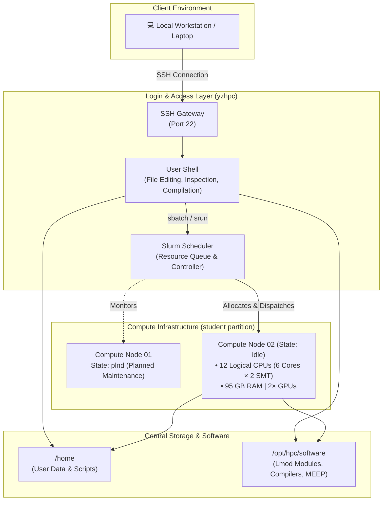
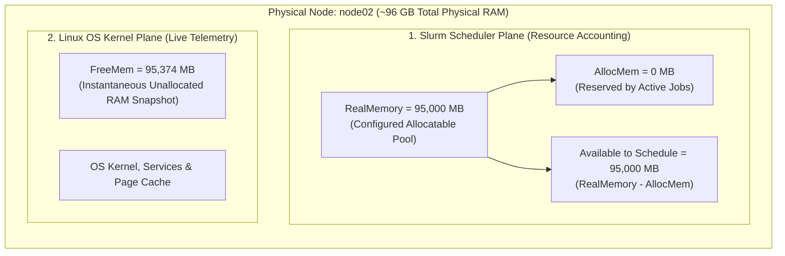
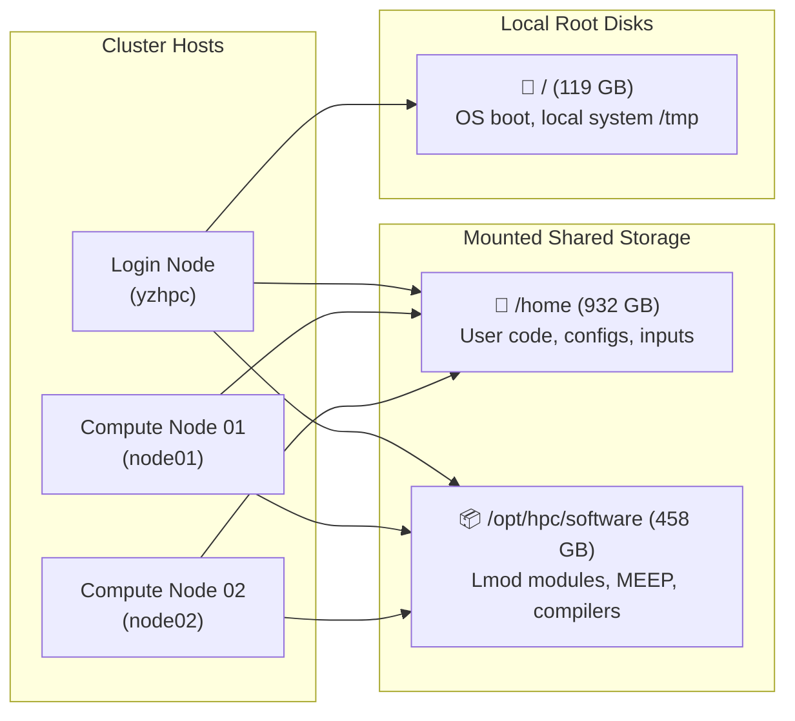
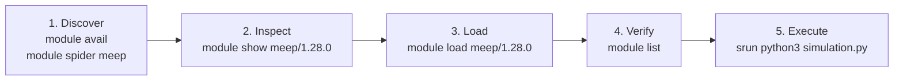



<!-- Reading Progress Bar -->
<div id="hpc-reading-progress"></div>
<script>
(function(){
  var bar = document.getElementById('hpc-reading-progress');
  window.addEventListener('scroll', function(){
    var doc = document.documentElement;
    var scrolled = doc.scrollTop || document.body.scrollTop;
    var total = (doc.scrollHeight || document.body.scrollHeight) - doc.clientHeight;
    bar.style.width = (total > 0 ? (scrolled / total) * 100 : 0) + '%';
  });
})();
</script>

<!-- Article Hero -->
<div class="hpc-article-hero">
  <div class="hpc-article-hero__inner">
    <span class="hpc-article-hero__series-badge">HPC &amp; MEEP Series · Part 2</span>
    <h1 class="hpc-article-hero__title">Know Your HPC System</h1>
    <p class="hpc-article-hero__lead">
      Before submitting a single job, take five minutes to survey your cluster. This article walks through the commands that reveal hardware, partitions, storage, and software — so every job script you write is grounded in reality.
    </p>
    <div class="hpc-article-meta">
      <span class="hpc-article-meta__item">📚 Intermediate</span>
      <span class="hpc-article-meta__sep"></span>
      <span class="hpc-article-meta__item">⏱ 18 min read</span>
      <span class="hpc-article-meta__sep"></span>
      <span class="hpc-article-meta__tag">Slurm</span>
      <span class="hpc-article-meta__tag">sinfo</span>
      <span class="hpc-article-meta__tag">scontrol</span>
      <span class="hpc-article-meta__tag">Lmod</span>
    </div>
  </div>
</div>

<div class="hpc-article-content">

<div class="notice--info">
<strong>Worked Example — YZ HPC Cluster</strong><br>
This article uses real command output from the <strong>YZ HPC cluster</strong> as a concrete worked example. Cluster status, free disk space, and software versions change over time — treat the values below as a snapshot, not a permanent guarantee. Always use your own cluster's live output when planning real simulation runs.
</div>

This quick survey answers the fundamental practical questions you face before writing a job script:

- Is a suitable compute node available?
- How much memory can safely be requested?
- Is MEEP installed with MPI / GPU support?
- Which Python, compiler, and MPI modules should the job load?

---

## 1. How the Pieces Fit Together

An HPC cluster separates user access, job scheduling, computation, and storage into distinct layers.

1. **Login Node** — Where you connect via SSH to inspect the system, manage files, and prepare jobs.
2. **Slurm Scheduler** — The central coordinator that queues jobs and allocates compute nodes when resources are available.
3. **Compute Nodes** — Dedicated machines where resource-intensive simulations actually execute.
4. **Shared Storage & Modules** — Centralized filesystems and software packages mounted across all nodes.

<div class="hpc-diagram-label">Figure 1 — Cluster Architecture Overview</div>


In our worked example the **login host** is an 8-CPU, 23-GiB machine. The `student` partition contains two compute nodes: `node02` (idle, 12 logical CPUs, ~95 GB RAM, 2 GPUs) and `node01` (state `plnd` — planned maintenance, not immediately available).

---

## 2. Start with Your Account and Access

Run `id` to see your numeric user ID (UID), primary group ID (GID), and all supplementary group memberships:

```bash
id
```

**Example output** *(account name omitted for privacy)*:

```text
uid=2011(<user>) gid=2001(student) groups=2001(student)
```

### Why account groups matter

| Field | Example Value | Role in HPC |
| :--- | :--- | :--- |
| **User ID (`uid`)** | `2011` | Unique numerical identifier for your user account. |
| **Primary Group (`gid`)** | `2001(student)` | Default ownership assigned to new files you create. |
| **Groups (`groups`)** | `2001(student)` | Determines access to Slurm partitions, restricted software, and shared lab directories. |

<div class="notice--warning">
<strong>Security & Privacy</strong> — Your group permissions directly affect access to files, software stacks, and scheduler partitions. Avoid publishing personal account identifiers or credentials in public articles, forum posts, or bug reports unless specifically required.
</div>

---

## 3. Ask Slurm What Is Available

Slurm provides several commands to inspect partitions, query queued jobs, and examine compute node hardware.

### 3.1 List partitions and node states (`sinfo`)

```bash
sinfo
```

**Example snapshot:**

```text
PARTITION AVAIL  TIMELIMIT  NODES  STATE NODELIST
student      up   12:00:00      1   plnd node01
student      up   12:00:00      1   idle node02
```

#### Understanding the output fields

- **`PARTITION` (`student`)** — The logical queue grouping compute resources.
- **`AVAIL` (`up`)** — Shows whether the partition is accepting job submissions.
- **`TIMELIMIT` (`12:00:00`)** — Maximum wall-clock time permitted for any single job (12 hours).
- **`NODES` & `NODELIST`** — How many nodes currently reside in that specific state.
- **`STATE`** — Slurm operational status of the nodes.

#### Common Slurm node states

| State | Status Meaning | Actionable Insight |
| :--- | :--- | :--- |
| `idle` | Node is powered on, healthy, and has unallocated resources. | Ready immediately for new allocations. |
| `alloc` | Node is fully allocated to one or more running jobs. | Jobs will wait until current runs finish. |
| `mix` | Node is partially allocated (some CPUs/memory used, some free). | Can accept smaller jobs if resources fit. |
| `plnd` | Planned maintenance or future reservation. | Not available for immediate dispatch. |
| `down` / `drain` | Node is offline or being emptied for service. | Slurm will not place new jobs here. |

<div class="notice--warning">
<strong>State Code Caution</strong> — Slurm state codes can include suffix characters (such as <code>*</code>, <code>~</code>, <code>#</code>, or <code>$</code>) indicating dynamic power states or maintenance flags. Do not guess a state from its abbreviation alone; consult <code>man sinfo</code>, run <code>sinfo --long</code>, or check your site's status documentation.
</div>

---

### 3.2 Check your jobs (`squeue`)

```bash
# View all jobs in the cluster queue
squeue

# View only your submitted jobs
squeue -u "$USER"
```

An output containing only the header line means no jobs are currently queued or running for that query:

```text
JOBID PARTITION     NAME     USER ST       TIME  NODES NODELIST(REASON)
```

<div class="notice--tip">
<strong>Beginner Tip</strong> — An empty <code>squeue -u "$USER"</code> output only means <em>your</em> account has no active jobs. It does not mean the cluster is idle — other users may be running jobs. Run <code>squeue</code> without flags to see the full cluster workload.
</div>

---

### 3.3 Inspect a compute node (`scontrol show node`)

```bash
scontrol show node node02
```

The full output is extensive and updates dynamically. Below are the key configuration fields from the `node02` snapshot:

```text
NodeName=node02 CoresPerSocket=6 ThreadsPerCore=2
CPUAlloc=0 CPUEfctv=12 CPUTot=12
Gres=gpu:2
RealMemory=95000 AllocMem=0
State=IDLE Partitions=student
CfgTRES=cpu=12,mem=95000M,billing=12
```

#### Key node parameters explained

- **`CoresPerSocket=6` & `ThreadsPerCore=2`** — 1 physical socket × 6 cores × 2 SMT threads = 12 logical CPUs.
- **`CPUTot=12` & `CPUEfctv=12`** — Slurm recognizes 12 schedulable logical CPU threads.
- **`CPUAlloc=0`** — Zero CPUs currently allocated at the moment of inspection.
- **`Gres=gpu:2`** — 2 physical GPUs registered as Generic Resources (GRES).
- **`RealMemory=95000` & `AllocMem=0`** — ~95 GB configured, 0 MB currently booked.
- **`State=IDLE`** — Node is ready for new jobs.

---

### 3.4 Understand the memory fields

Slurm and Linux report multiple memory metrics. They are related but not interchangeable:

| Field | Plain Meaning | Value in This Snapshot |
| :--- | :--- | :--- |
| **`RealMemory`** | Maximum memory Slurm is configured to schedule on this node. | `95000` MB (~95 GB) |
| **`AllocMem`** | Memory currently reserved for active jobs by Slurm's resource ledger. | `0` MB |
| **`FreeMem`** | Real-time reading from the compute node's OS kernel. | `95374` MB |

<div class="hpc-diagram-label">Figure 2 — Slurm vs. OS Memory Perspectives</div>


<div class="notice--warning">
<strong>Crucial Memory Sizing Rule</strong> — Do not calculate a safe job request by simply subtracting <code>AllocMem</code> from <code>RealMemory</code>, and never treat <code>FreeMem</code> as a guarantee. Slurm decides allocation based on site policies, and the OS always requires headroom for kernel buffers and system I/O.
</div>

---

### 3.5 What does "CPU thread" mean here?

Understanding the difference between physical cores, hardware threads, and software threads is essential for optimal simulation performance.

#### Physical cores vs. hardware threads (SMT)

- **Physical Core** — An independent silicon execution engine with its own ALUs, FPUs, and L1/L2 caches. This node has **6 physical cores**.
- **Hardware Thread (SMT)** — Each physical core exposes 2 execution pipelines to the OS. The system reports $6 \times 2 = 12$ logical CPUs.

<div class="hpc-diagram-label">Figure 3 — CPU Socket, Core, and Thread Hierarchy</div>


Two hardware threads on one core share the underlying silicon execution resources — they do not equal two separate physical cores. Numerical simulations like FDTD often achieve maximum speed by binding **one software thread per physical core**.

#### Hardware threads vs. software threads (OpenMP)

For an OpenMP multithreaded simulation, the Slurm batch script maps threads as follows:

```bash
#!/bin/bash
#SBATCH --job-name=openmp_test
#SBATCH --partition=student
#SBATCH --nodes=1
#SBATCH --ntasks=1
#SBATCH --cpus-per-task=6

# Set OpenMP thread count to match allocated CPUs
export OMP_NUM_THREADS="$SLURM_CPUS_PER_TASK"

# Launch application
srun ./my_openmp_program
```

This requests 6 logical CPUs for 1 task and instructs the OpenMP runtime to spawn exactly 6 worker threads.

---

## 4. Distinguish the Login Node from Compute Nodes

When you run `lscpu` and `free -h` after logging in, you are inspecting the **login node**, not the compute node.

```bash
lscpu
free -h
```

**Login host example output:**

```text
Architecture:                x86_64
CPU(s):                      8
Vendor ID:                   AuthenticAMD
Model name:                  AMD FX(tm)-8350 Eight-Core Processor
```

```text
               total        used        free      shared  buff/cache   available
Mem:            23Gi       6.1Gi       9.5Gi       297Mi       8.5Gi        17Gi
Swap:          4.0Gi          0B       4.0Gi
```

### Login node vs. compute node comparison

| Feature | Login Node (`yzhpc`) | Compute Node (`node02`) |
| :--- | :--- | :--- |
| **Primary Purpose** | SSH access, script editing, job submission | Heavy computation & parallel runs |
| **CPU Architecture** | 8-core AMD FX-8350 | 6-core (12 SMT threads) compute processor |
| **Total Memory** | 23 GiB (shared among all active users) | 95 GB dedicated allocatable RAM |
| **GPU Accelerators** | None | 2 Dedicated GPUs (`Gres=gpu:2`) |
| **Execution Policy** | Strict limits — no heavy CPU/GPU work | Managed entirely via Slurm |

<div class="notice--danger">
<strong>Golden Rule of HPC</strong> — Never use login-node hardware specs to size your compute batch jobs. Always size your jobs according to compute node properties reported by Slurm (<code>scontrol show node</code>).<br><br>
To inspect an actual compute node environment directly, run a quick interactive Slurm step:<br>
<code>srun --partition=student --nodes=1 --pty lscpu</code>
</div>

---

## 5. Check Storage and Software

Before submitting large simulation runs, verify where files should be stored and what software modules are available.

### 5.1 Inspect mounted filesystems (`df -h`)

```bash
df -h
```

**Example snapshot:**

```text
Filesystem      Size  Used Avail Use% Mounted on
/dev/sdb2       119G   38G   80G  32% /
/dev/sda1       458G   51G  403G  12% /opt/hpc/software
/dev/sdc1       932G  109G  822G  12% /home
```

<div class="hpc-diagram-label">Figure 4 — Shared Filesystem Topology</div>


#### Filesystem considerations

- **`/home` (932 GB)** — Network-mounted directory for scripts, configurations, and personal code.
- **`/opt/hpc/software` (458 GB)** — Centralized software repository containing compilers, libraries, and scientific packages.
- **Quotas vs. Capacity** — `df -h` reports overall filesystem space, not your individual user quota. Check your quota using `quota -s` or cluster-specific tools.
- **Scratch Disks** — For large time-step dumps or field monitor data, check whether your cluster provides a fast, high-capacity `/scratch` partition.

---

### 5.2 Inspect Lmod software modules

```bash
# View currently loaded modules in your shell
module list

# View all available software modules on the cluster
module avail
```

**Example Lmod listing:**

```text
--------------------------- /opt/hpc/modules/Core ---------------------------
cuda/12.9                     gcc/12.4
gcc/13.2 (D)                  openmpi/5.0.10
python/3.11.9 (D)             meep/1.28.0
lammps/4Jul2026-cpu           gromacs/2024.4-gpu (D)
qe/7.6                        yambo/5.3.0-gpu (D)
```

The `(D)` flag marks the default module version loaded when no specific version number is requested (e.g., `module load gcc` loads `gcc/13.2`).

<div class="hpc-diagram-label">Figure 5 — Lmod Workflow: Discover → Inspect → Load → Verify → Execute</div>


#### Module inspection commands

```bash
# Search for any module matching 'meep' and list prerequisites
module spider meep

# Inspect environment variables configured by the module
module show meep/1.28.0

# Load the module into your current environment
module load meep/1.28.0

# Confirm it is active
module list
```

<div class="notice--tip">
<strong>Module Best Practice</strong> — The presence of <code>meep/1.28.0</code> confirms MEEP is installed, but check <code>module show</code> and site documentation to verify whether this build supports MPI parallel execution, Python bindings, or GPU acceleration.
</div>

---

## 6. A Repeatable Cluster-Survey Workflow

Follow this 8-step verification pipeline every time you connect to a new cluster or after major system maintenance:

<div class="hpc-diagram-label">Figure 6 — Complete Cluster Survey Workflow</div>


<div class="hpc-summary-box">
<h3>Summary of Findings — YZ HPC Cluster Snapshot</h3>

1. **Partition** — Submit jobs to the `student` partition (12-hour maximum wall time).
2. **Compute Resources** — `node02` is available with 6 physical cores (12 logical CPUs), 95 GB memory, and 2 GPUs.
3. **Storage** — User files reside on shared `/home`; software modules reside on `/opt/hpc/software`.
4. **Software** — `meep/1.28.0`, `python/3.11.9`, `openmpi/5.0.10`, `cuda/12.9`, and `gcc/13.2` are available.
5. **Execution Model** — Use the login node only for file management and submission; run all compute workloads via Slurm on `node02`.
</div>

### Quick reference: Cluster survey toolkit

| Target | Command | Purpose |
| :--- | :--- | :--- |
| **User & Groups** | `id` | Confirm UID, GID, and project group memberships |
| **Partitions & Nodes** | `sinfo` | View partitions, time limits, and node availability |
| **Job Queue** | `squeue -u "$USER"` | Check status of queued and running jobs |
| **Node Hardware** | `scontrol show node <name>` | Inspect CPUs, cores, sockets, memory, and GPUs |
| **Storage Capacity** | `df -h` | Verify mounted shared filesystems and free disk space |
| **Software Modules** | `module avail` | List installed scientific software and compiler stacks |
| **Module Details** | `module show <name>` | Check dependencies and environment variables |

For current cluster information, policies, and system documentation, see the [YZ HPC website and documentation](https://share.google/E93GupBkSewxV2GpJ).

---

## 7. Before Moving On

You now have a structured picture of your cluster: the login host, scheduler partitions, compute node resources, mounted storage volumes, and software module ecosystem. These details provide everything required to write robust Slurm job scripts that request appropriate resources and load compatible environments.

In the next article, we will turn this inventory into a practical Slurm batch job, monitor its execution lifecycle in real time, and inspect output logs.

<div class="hpc-pagination">
  <a class="hpc-pagination__link" href="/hpc/meep/01-what-are-slurm-and-lmod/">
    <span class="hpc-pagination__dir">← Previous Article</span>
    <span class="hpc-pagination__title">What are Slurm and Lmod?</span>
  </a>
  <a class="hpc-pagination__link hpc-pagination__link--next" href="/hpc/meep/">
    <span class="hpc-pagination__dir">Series Overview →</span>
    <span class="hpc-pagination__title">HPC &amp; MEEP Series</span>
  </a>
</div>

</div><!-- end .hpc-article-content -->