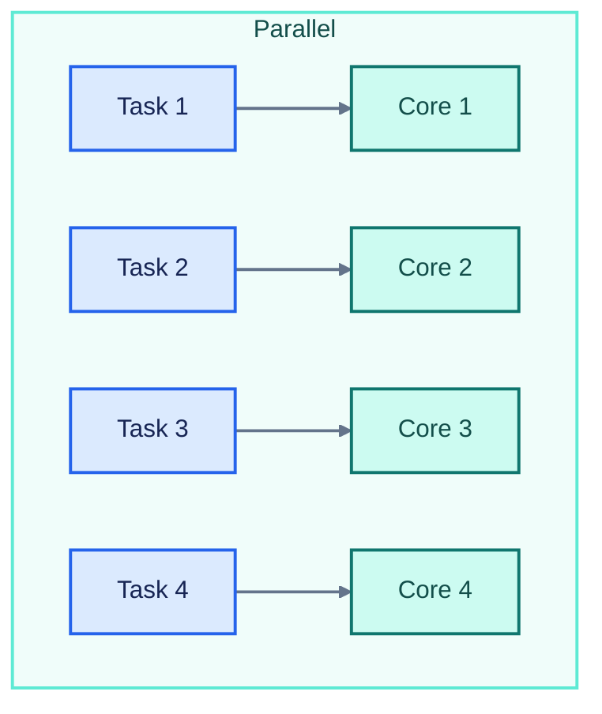
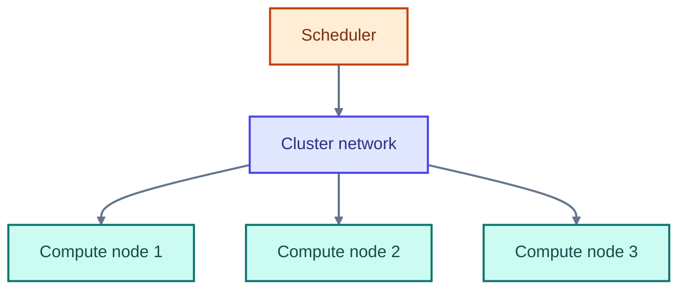
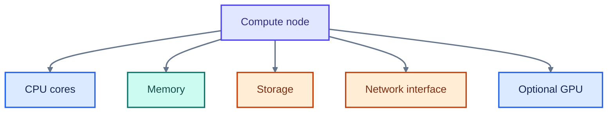
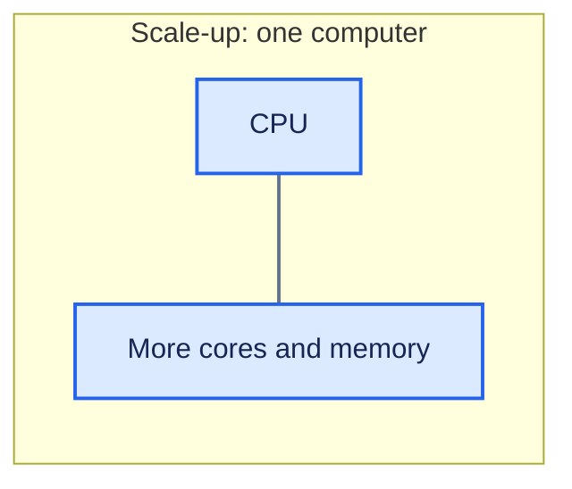
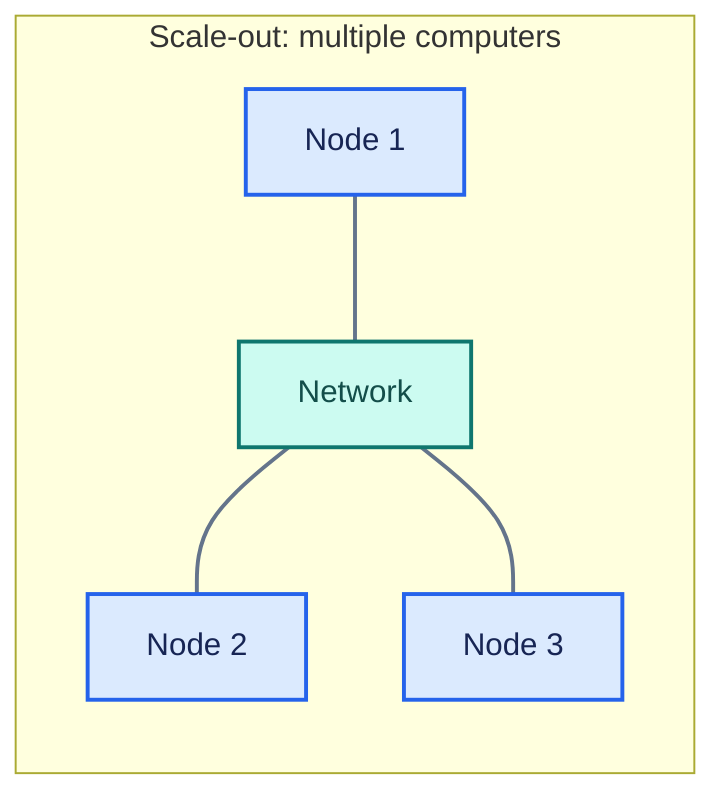



<header class="hpc-article-hero">
	

		HPC &amp; MEEP Series · Part 1
		<h1 class="hpc-article-hero__title">What Is High Performance Computing?</h1>
		

			A simple introduction to serial and parallel computing, HPC clusters, and how a cluster runs a computational job.
		

		

			Parallel computing
			Clusters
			Slurm
		

	

</header>

<article class="hpc-article-content" markdown="1">

## Serial and Parallel Computing

An ordinary computer can perform a calculation one step after another. This is called **serial computing**. HPC makes greater use of **parallel computing**: when a problem can be divided into parts, multiple processors can work on those parts at the same time.

Imagine a problem with many calculations. In a serial approach, the work is done in sequence:

Figure 1 · Serial execution

If the problem can be divided, some of those calculations can happen at the same time:

Figure 2 · Parallel execution across cores

This can reduce the time needed for a computation. But not every problem can be perfectly parallelized. Some calculations depend on earlier results, so the amount of useful parallelism depends on the problem.

In a simple way:

Figure 3 · From a large problem to parallel work

High Performance Computing (HPC) uses computing resources to solve large or demanding problems. Parallel processing is an important part of HPC, but a complete HPC system also needs memory, storage, networking, and software to manage the work [1, 2].

### Why Do We Need HPC?

We use HPC when a computation is too large or time-consuming for a single computer to handle efficiently. Scientific simulations, engineering calculations, and large-scale data analysis are some examples [2, 4].

## What Is an HPC Cluster?

An **HPC cluster** is a group of connected computers that work together as a computing system. The computers are called **nodes**. Each node has its own processors, memory, and other resources, and the nodes communicate over a network [1].

Figure 4 · Compute nodes connected through a cluster network

So an HPC cluster is not just one extremely powerful computer. It is a group of computers that can share a workload when the software and problem allow it.

### What Is a Node?

An individual computer in a cluster is called a **node**. A node may have:

- CPU cores
- RAM
- storage
- network interfaces
- GPUs, on some systems

Different workloads benefit from different resources. For example, GPUs can accelerate some workloads with many parallel mathematical operations, but they are not required for every HPC job [2].

Figure 5 · Common resources inside a compute node

## Scale-up and Scale-out

There are two common ways to increase the resources available to a computation [1].

### Scale-up

With **scale-up**, a single computer uses more of its own resources, such as additional CPU cores or memory.

Figure 6 · Scale-up adds capacity to one system

### Scale-out

With **scale-out**, work is distributed across multiple computers connected through a network. This is one way to use an HPC cluster.

Figure 7 · Scale-out connects multiple systems

## How Does an HPC Job Work?

The exact workflow depends on the software and the problem, but a typical HPC job follows these steps:

1. **Prepare the problem.** The program and input data are prepared for computation.
2. **Divide the work.** If possible, the problem is split into tasks or data regions that can be processed in parallel.
3. **Request resources.** A job scheduler manages the cluster and assigns resources such as nodes, CPU cores, memory, and sometimes GPUs. Slurm is one example of a workload manager [3].
4. **Compute and communicate.** The assigned resources perform their parts of the calculation. They may exchange data or intermediate results as the program runs.
5. **Collect results.** The program saves or combines its output for analysis.

In this series I will explain **SLURM**, the workload manager used on many HPC systems, including YZ HPC, which I am using. We will look at how to request resources and run jobs in the next articles.

Figure 8 · A typical HPC job lifecycle

<h3>In Short</h3>

An HPC cluster is **a collection of interconnected computers that work together to solve large computational problems using parallel computing**.

## References

1. Intel, [What is HPC?](https://www.intel.com/content/www/us/en/learn/what-is-hpc.html)
2. IBM, [What is high-performance computing (HPC)?](https://www.ibm.com/think/topics/hpc)
3. SchedMD, [Slurm Workload Manager overview](https://slurm.schedmd.com/overview.html)
4. NVIDIA, [High-performance computing](https://www.nvidia.com/en-us/glossary/high-performance-computing/)

</article>

