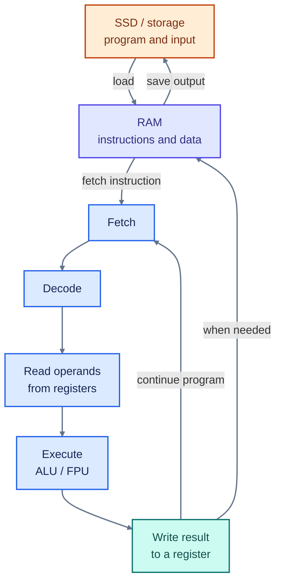



<header class="hpc-article-hero">
	

		HPC &amp; MEEP Series · Part 1
		<h1 class="hpc-article-hero__title">How Does a Computer Process Data?</h1>
		

			A quick look at how a program and its data move from storage through memory and the CPU to a result.
		

	

</header>

<article class="hpc-article-content" markdown="1">

## From Program to Result

A program is a list of machine instructions that tells the processor what to do. The operating system loads the program and required data from storage into RAM. The CPU then repeatedly fetches an instruction, decodes it, and executes it [1].

Figure 1 · A simplified path from stored program to result

The CPU uses **registers** for values it is working with immediately. A small **cache** keeps copies of recently or frequently used instructions and data close to the CPU, reducing trips to RAM. The exact path varies by processor; data does not always pass through every level in a fixed sequence [2].

For example, to calculate `2 + 3`, the CPU fetches the add instruction, reads the two values from registers, adds them in an arithmetic unit, and writes `5` back to a register. The program can then use that result or save it to memory or a file.

## In Short

Storage keeps programs and files; RAM holds active work; the CPU executes instructions using registers and cached data, then produces results.

## References

1. RISC-V International, [RV32I Base Integer Instruction Set](https://docs.riscv.org/reference/isa/v20260120/unpriv/rv32.html)
2. IBM, [Mainframe hardware concepts](https://www.ibm.com/docs/en/zos-basic-skills?topic=concepts-mainframe-hardware)

</article>

