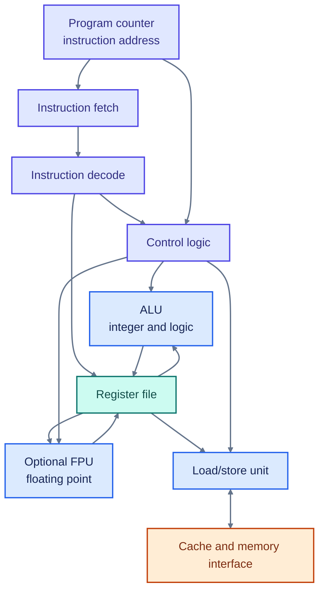



<header class="hpc-article-hero">
	

		HPC &amp; MEEP Series · Part 1
		<h1 class="hpc-article-hero__title">Inside the CPU: Registers, ALU, Control Unit, and the Instruction Cycle</h1>
		

			A beginner-friendly look at the hardware that fetches, interprets, and executes machine instructions.
		

	

</header>

<article class="hpc-article-content" markdown="1">

## What Is Inside a CPU?

In the previous article, we looked at storage, RAM, cache, and the CPU. Now we can look one level deeper. A CPU is not a single calculator: it contains registers, control and instruction-handling logic, and execution units that cooperate to run instructions.

The diagram is a **conceptual model**, not a complete design. Modern processors contain many additional structures, and their exact organization varies.

Figure 1 · A simplified view of a CPU core

## The Main Parts

| Part | What it does |
| --- | --- |
| **Registers** | Hold the small values an instruction is currently using, along with processor state. |
| **Program counter (PC)** | Tracks instruction location. In RISC-V, the architectural `pc` holds the address of the current instruction [1]. |
| **ALU** | Performs integer arithmetic and logical operations such as addition, comparison, and bitwise operations. |
| **FPU** | Performs floating-point operations when the processor includes suitable floating-point hardware. In RISC-V, floating-point support is an ISA extension [3]. |
| **Control logic and decoder** | Interpret an instruction and coordinate the required register reads, execution, and result write. |
| **Load/store unit** | Transfers data between registers and memory. In RISC-V's base integer ISA, arithmetic operates on registers; load and store instructions access memory [1]. |

For example, `ADD x3, x1, x2` means: read values from registers `x1` and `x2`, add them, and write the result to `x3` [1]. The register names and instruction details depend on the processor's instruction set architecture.

## Fetch, Decode, Execute

A useful first model of instruction execution is:

Figure 2 · The instruction cycle

For `ADD x3, x1, x2`, the processor fetches and decodes the instruction, reads `x1` and `x2`, performs the addition, then writes the result to `x3`. The PC advances to the next instruction unless a branch or jump changes the flow [1].

This cycle is a teaching model, not a claim that every modern CPU completes one instruction at a time. **Pipelining** lets different instructions occupy different stages at once; multiple execution units and out-of-order execution can add further overlap.

## Clock Speed and Performance

A clock frequency of **4 GHz** means about four billion clock cycles per second. It does **not** mean four billion instructions per second: an instruction may take multiple cycles, and processors may execute parts of several instructions concurrently. Performance also depends on the program, execution units, memory behavior, and parallelism.

## ISA and Microarchitecture

An **instruction set architecture (ISA)** defines the instructions and processor state software can use. The **microarchitecture** is how a particular CPU implements that interface. Different processors can implement the same ISA with different pipelines, caches, and execution units [2].

## Why This Matters for HPC

Scientific simulations repeat operations over many values and time steps. Their performance can therefore depend on floating-point capability, registers, cache and memory access, execution units, and how well work is parallelized. The CPU turns each program into instructions, but the data path often determines how quickly those instructions can make progress.

<h3>In Short</h3>

The CPU fetches and decodes instructions, uses registers to supply operands, performs work in execution units, and writes results back. Modern processors overlap this work, so fetch-decode-execute is a useful model, not a literal one-step-at-a-time schedule.

## References

1. RISC-V International, [RV32I Base Integer Instruction Set](https://docs.riscv.org/reference/isa/v20260120/unpriv/rv32.html)
2. RISC-V International, [Introduction to the RISC-V ISA](https://docs.riscv.org/reference/isa/v20240411/unpriv/intro.html)
3. RISC-V International, [RV64I Base Integer Instruction Set](https://docs.riscv.org/reference/isa/v20260120/unpriv/rv64.html)

</article>

