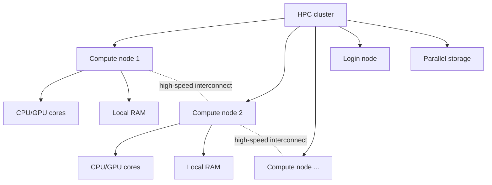
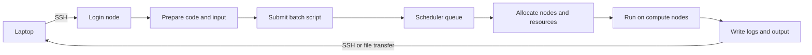
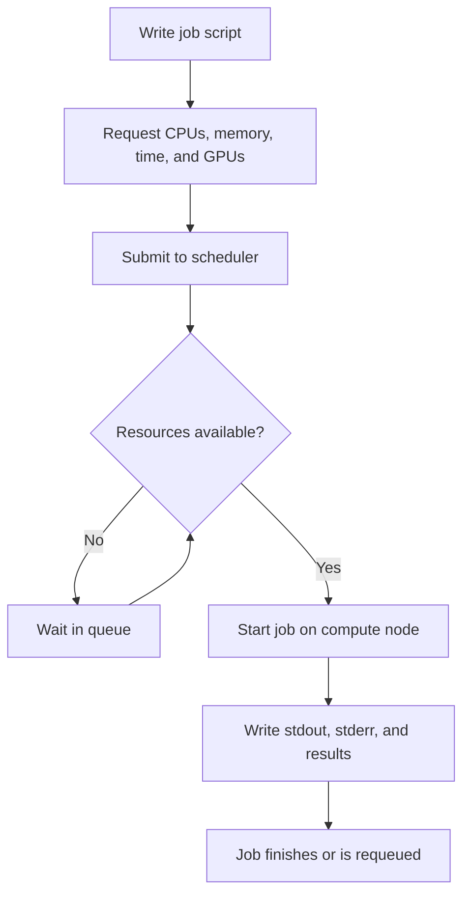
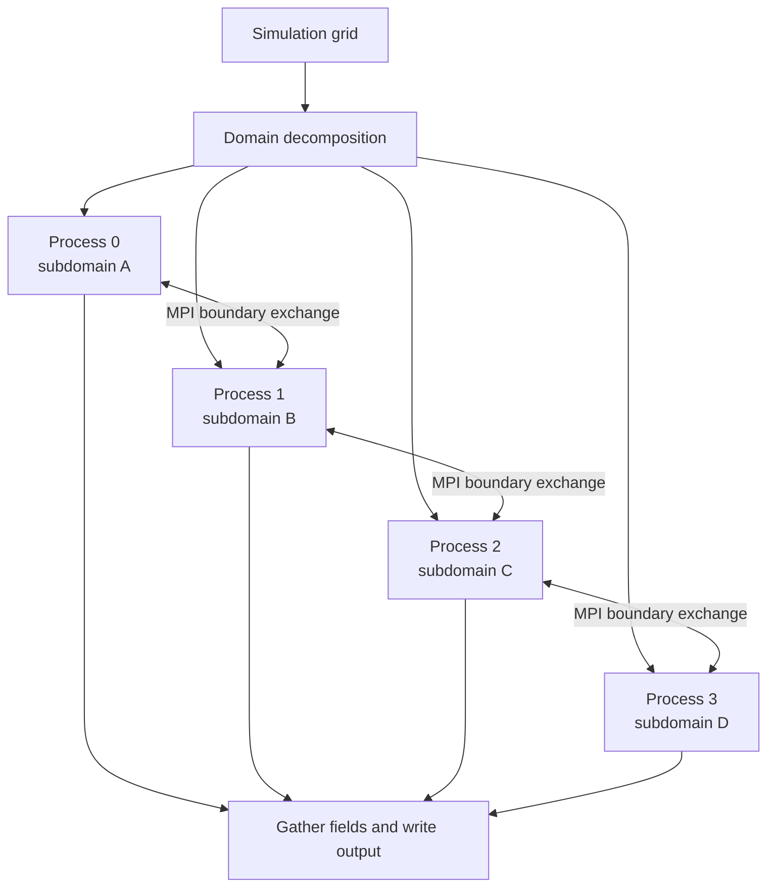

This is Part 1 of the [HPC and MEEP series](/hpc/meep/). Before running an electromagnetic simulation on a cluster, it helps to understand what an HPC system is, how its parts fit together, and how a program gets from your laptop to a compute node.

By the end of this article, you should be able to:

- explain why a cluster is useful for large simulations;
- distinguish cores, nodes, memory, storage, and the network interconnect;
- describe the path of a batch job through an HPC system; and
- connect to a cluster, load software, and submit a basic Slurm job.

## 1. Why use HPC?

High-performance computing (HPC) combines many processors, large memory systems, fast storage, and a low-latency network. The goal is not simply to make one instruction run faster. The goal is to divide a problem into smaller pieces and solve many of those pieces at the same time.

For example, an FDTD simulation divides space into a grid. Each grid cell must be updated repeatedly as the fields evolve in time. A larger grid, finer resolution, or longer simulation time increases the memory and compute cost. A cluster makes it possible to distribute that work across many processes.


HPC is used for weather and climate models, computational physics, drug discovery, engineering design, genomics, and machine learning. In this series, the focus is computational electromagnetics and MEEP, an open-source finite-difference time-domain (FDTD) solver.

## 2. The anatomy of an HPC cluster

An HPC cluster is a collection of computers connected by a high-speed network and managed as a shared resource. The main building blocks are:

- **Core:** An individual processing unit that executes instructions.
- **CPU or GPU:** A processor containing one or more cores. GPUs contain many simpler cores optimized for highly parallel operations.
- **Node:** One server containing processors, memory, local storage, and a network interface.
- **Cluster:** Many nodes connected through an interconnect and managed by a scheduler.
- **Interconnect:** The network that lets processes on different nodes exchange data. InfiniBand and HPE Slingshot are common examples.



### Nodes and cores

Each compute node has its own memory and processors. A job may use one core on one node, many cores on one node, or many nodes. When a simulation spans multiple nodes, its processes must communicate through the interconnect.

This is why a cluster is not the same as one very large shared-memory computer: memory is usually **distributed**. Process 0 cannot read another node's RAM as if it were local RAM. The application must exchange data explicitly, commonly through MPI.

### Memory and storage

**RAM** holds the data that active processes are using. It is fast, but it is temporary and normally local to each node. A simulation that needs more memory than is available on its allocated nodes cannot run successfully.

**Storage** holds source code, input files, checkpoints, and output. HPC systems commonly provide:

- a **home directory** for code and important files;
- a **scratch directory** for large, temporary simulation data; and
- a **parallel file system** designed for many nodes to read and write concurrently.

The exact policies vary by cluster. Always check storage quotas, purge rules, and backup policies before starting a large run.

## 3. Laptop versus cluster

The important difference is the execution model, not only the number of cores.

| Feature | Laptop or workstation | HPC cluster |
| --- | --- | --- |
| Processing | A few CPU cores, sometimes one GPU | Many cores across many nodes |
| Memory | Shared within one computer | Usually distributed across nodes |
| Network | General-purpose Ethernet or Wi-Fi | Low-latency HPC interconnect |
| Storage | Local SSD or hard drive | Shared and parallel file systems |
| Workload | Interactive, short, and mixed tasks | Large, repeatable, parallel workloads |
| Execution | Start a program immediately | Request resources through a scheduler |
| Typical software | Installed for one user | Loaded through modules or environments |

HPC is not automatically faster for every task. A small script may run more quickly on a laptop because it avoids queue time and communication overhead. HPC becomes valuable when the problem is large enough to benefit from additional memory, processors, GPUs, or long uninterrupted runtime.

## 4. The HPC workflow

Most users interact with a cluster through a login node. The login node is for preparing work, not for running expensive simulations. A scheduler places submitted jobs on suitable compute nodes.



This separation protects the shared system. Login nodes serve many people, while compute nodes are reserved for scheduled workloads.

## 5. Connecting and navigating

### Connect with SSH

Your institution will provide a hostname, username, and authentication method. A typical connection looks like this:

```bash
ssh username@hpc.example.edu
```

Use the hostname and username supplied by your cluster administrator. Do not place passwords or private keys in a script or public repository.

### Useful Linux commands

```bash
pwd                  # Show the current directory
ls -lah              # List files with sizes and permissions
cd project           # Enter a directory
mkdir -p results     # Create a directory
cp input.py results/ # Copy a file
scp input.py username@hpc.example.edu:~/project/
```

### Load software with modules

Clusters often provide several versions of compilers, Python, MPI, and scientific libraries. Modules modify your environment for the current shell without replacing the system installation.

```bash
module avail
module load python/3.11
module list
```

The exact module names are cluster-specific. Later in this series, the same idea will be used to prepare an MPI-enabled MEEP environment.

## 6. Job schedulers

A scheduler, such as Slurm or PBS, coordinates users competing for shared resources. It reads the requirements in your job script, places the job in a queue, and starts it when suitable resources become available.



### A minimal Slurm script

Save this as `submit_job.sh`:

```bash
#!/bin/bash
#SBATCH --job-name=hpc-test
#SBATCH --output=logs/%x-%j.out
#SBATCH --error=logs/%x-%j.err
#SBATCH --time=00:10:00
#SBATCH --ntasks=1
#SBATCH --cpus-per-task=4
#SBATCH --mem=4G
#SBATCH --partition=standard

module load python/3.11
srun python3 my_simulation.py
```

Create the log directory and submit the job:

```bash
mkdir -p logs
sbatch submit_job.sh
squeue -u "$USER"
```

The scheduler directives are requests, not guarantees. Partition names, time limits, memory syntax, and available modules differ between clusters. Read your cluster's documentation before copying a script unchanged.

### Common Slurm commands

| Action | Command |
| --- | --- |
| Submit a batch job | `sbatch submit_job.sh` |
| List your jobs | `squeue -u $USER` |
| Inspect a job | `scontrol show job JOB_ID` |
| View completed-job data | `sacct -j JOB_ID` |
| Cancel a job | `scancel JOB_ID` |
| Check partitions | `sinfo` |
| Request an interactive shell | `srun --pty --time=00:30:00 bash` |

PBS and PBS Pro use a different command set, but the ideas are the same: request resources, wait for allocation, run the program, and collect the output.

## 7. What happens to a parallel simulation?

For an MPI-enabled program, the scheduler allocates resources and starts multiple processes. Each process owns part of the work and communicates with neighboring processes when it needs data from another part of the problem.



The more processes you add, the less work each process performs. However, communication and file I/O also increase. Good scaling requires a useful balance between computation, communication, memory, and storage performance. Part 4 of this series will apply these ideas to parallel MEEP.

## 8. Practical checklist

Before submitting a large job, confirm:

1. The code runs correctly on a small test case.
2. The required modules or environment are loaded in the batch script.
3. The requested time, memory, cores, and GPUs match the workload.
4. Output is written to scratch or another appropriate location.
5. Logs are saved so failures can be diagnosed.
6. You know how to monitor and cancel the job.

## Summary

HPC is a coordinated system for solving problems that are too large, slow, or memory-intensive for one computer. A cluster combines compute nodes, distributed memory, high-speed interconnects, shared storage, and a scheduler. The normal workflow is:


In the next part, we will work more closely with cluster environments: storage locations, software modules, batch scripts, and job monitoring. After that foundation, we can move from a small local MEEP test to a reproducible cluster workflow.