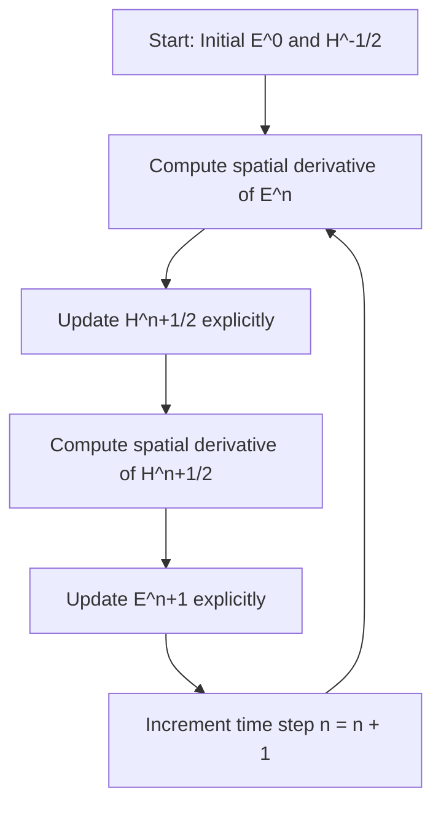

When we first study classical electrodynamics, Maxwell’s equations look remarkably symmetric, elegant, and unified. They describe how electric ($\mathbf{E}$) and magnetic ($\mathbf{H}$ or $\mathbf{B}$) fields dynamically create and sustain one another in space and time.

However, when we attempt to translate these continuous partial differential equations into a computer algorithm to solve complex real-world problems—such as optical wave propagation, antenna design, or [computational metaoptics](/metaoptics/#computational-metaoptics)—we immediately hit a major mathematical roadblock: **a circular recursive loop**.

In this post, we will explore:
1. Maxwell’s curl equations and the need for numerical discretization.
2. The fundamental **coupling paradox** (the "chicken-and-egg" problem of $\mathbf{E}$ and $\mathbf{H}$).
3. How Kane S. Yee (1966) elegantly resolved this issue using space-time staggering—giving birth to the **Finite-Difference Time-Domain (FDTD)** method.
4. A complete mathematical explanation of the **Yee Grid** and the **Leapfrog Algorithm**.

---

## 1. Maxwell's Curl Equations: The Continuous World

In source-free, isotropic, non-magnetic, and non-conductive media, electrodynamics is governed by Maxwell's two curl equations:

$$\nabla \times \mathbf{E} = -\mu \frac{\partial \mathbf{H}}{\partial t} \quad \text{(Faraday's Law of Induction)}$$

$$\nabla \times \mathbf{H} = \varepsilon \frac{\partial \mathbf{E}}{\partial t} \quad \text{(Ampère-Maxwell Law)}$$

where:
- $\mathbf{E}$ is the electric field vector $[V/m]$.
- $\mathbf{H}$ is the magnetic field vector $[A/m]$.
- $\varepsilon$ is the electric permittivity $[F/m]$.
- $\mu$ is the magnetic permeability $[H/m]$.

To make the physics crystal-clear without getting lost in 3D vector components, let's restrict ourselves to a **1D transverse electromagnetic wave (TEM)** traveling along the $x$-axis. Suppose the electric field is polarized along $y$ ($E_y$) and the magnetic field is polarized along $z$ ($H_z$). 

The continuous 1D partial differential equations simplify to:

$$\frac{\partial H_z}{\partial t} = -\frac{1}{\mu} \frac{\partial E_y}{\partial x}$$

$$\frac{\partial E_y}{\partial t} = -\frac{1}{\varepsilon} \frac{\partial H_z}{\partial x}$$

Notice the fundamental coupling here:
* The time derivative (rate of change) of $H_z$ depends on the spatial gradient of $E_y$.
* The time derivative (rate of change) of $E_y$ depends on the spatial gradient of $H_z$.

---

## 2. The Naive Discretization Dilemma: An Infinite Recursive Loop

To solve these differential equations on a digital computer, we must **discretize** both continuous space $x$ and continuous time $t$ into a discrete grid:

$$x \to i \cdot \Delta x \quad (i = 0, 1, 2, \dots, N_x)$$

$$t \to n \cdot \Delta t \quad (n = 0, 1, 2, \dots, N_t)$$

where $\Delta x$ is the spatial step size and $\Delta t$ is the time step size.

### The Naive Grid Approach
What if we evaluate both $E_y$ and $H_z$ at the **exact same spatial nodes** $x_i = i\Delta x$ and the **exact same temporal steps** $t_n = n\Delta t$?

Using standard forward or central finite differences to step forward in time from step $n$ to step $n+1$:

$$E_y^{n+1}(i) \approx E_y^n(i) - \frac{\Delta t}{\varepsilon} \left[ \frac{\partial H_z}{\partial x} \right]^{?}$$

$$H_z^{n+1}(i) \approx H_z^n(i) - \frac{\Delta t}{\mu} \left[ \frac{\partial E_y}{\partial x} \right]^{?}$$

Now ask yourself: **At what time step should we compute the spatial derivatives $\frac{\partial H_z}{\partial x}$ and $\frac{\partial E_y}{\partial x}$?**

* If we evaluate the spatial derivative of $H_z$ at the **current time step $n$**, the numerical algorithm becomes **unstable**.
* If we evaluate the spatial derivative at the **next time step $n+1$** (to ensure stability via an implicit scheme):
  - To calculate $E_y^{n+1}(i)$, we need $H_z^{n+1}(i+1)$ and $H_z^{n+1}(i-1)$.
  - But to know $H_z^{n+1}$, we need $E_y^{n+1}(i+1)$ and $E_y^{n+1}(i-1)$!

### The Circular Trap
We fall into an **infinite recursive loop**:
> *"To know $E$ at the new time, we must already know $B$ (or $H$) at the new time. But to know $B$ (or $H$) at the new time, we must already know $E$ at the new time."*

$$E^{n+1} \Longleftrightarrow H^{n+1}$$

In numerical analysis, this implies that $E$ and $H$ are **simultaneously coupled**. You cannot solve for one explicitly without solving a massive system of linear equations across the entire grid at every single time step. This is computationally expensive, memory-intensive, and defeats the goal of a fast, local wave simulator.

---

## 3. Kane Yee's Breakthrough: The Yee Grid & Leapfrog Scheme

In 1966, **Kane S. Yee** published a landmark paper that solved this fundamental circular dependency with a stroke of genius.

Yee realized that **$\mathbf{E}$ and $\mathbf{H}$ should neither exist at the same place in space nor at the same moment in time!**

Instead, he proposed staggering the fields in both space and time by **half-step intervals** ($\Delta x / 2$ and $\Delta t / 2$).

```
        Time Stepping (Leapfrog Scheme)

  E(n-1)         E(n)          E(n+1)        ... [t = n*dt]
    |              |              |
----+--------------+--------------+------> Time (t)
          |              |
       H(n-1/2)       H(n+1/2)               ... [t = (n+1/2)*dt]
```

### 1. Temporal Staggering (Leapfrog in Time)
* Electric fields $\mathbf{E}$ are defined at **integer time steps**: $t = n \Delta t$.
* Magnetic fields $\mathbf{H}$ are defined at **half-integer time steps**: $t = (n + 1/2) \Delta t$.

### 2. Spatial Staggering (The Yee Cell in Space)
In 1D space:
* Electric field components $E_y$ are placed at **integer grid nodes**: $x = i \Delta x$.
* Magnetic field components $H_z$ are placed at **half-integer grid nodes**: $x = (i + 1/2) \Delta x$.

```
        1D Spatial Grid Staggering

  E_y(i-1)       E_y(i)        E_y(i+1)      ... [x = i*dx]
    |              |              |
----+--------------+--------------+------> Position (x)
          |              |
      H_z(i-1/2)     H_z(i+1/2)              ... [x = (i+1/2)*dx]
```

---

## 4. How Space-Time Staggering Escapes the Recursive Loop

With the Yee discretization, let's write out the finite-difference approximations for our 1D Maxwell curl equations.

### Step 1: Updating $H_z$ at Half-Time Steps $(n + 1/2)$
Faraday's law $\frac{\partial H_z}{\partial t} = -\frac{1}{\mu} \frac{\partial E_y}{\partial x}$ is evaluated at position $(i+1/2)$ and time $n$:

$$\frac{H_z^{n+1/2}\left(i+\frac{1}{2}\right) - H_z^{n-1/2}\left(i+\frac{1}{2}\right)}{\Delta t} = -\frac{1}{\mu} \left[ \frac{E_y^n(i+1) - E_y^n(i)}{\Delta x} \right]$$

Rearranging to solve explicitly for $H_z^{n+1/2}$:

$$H_z^{n+1/2}\left(i+\frac{1}{2}\right) = H_z^{n-1/2}\left(i+\frac{1}{2}\right) - \frac{\Delta t}{\mu \Delta x} \left[ E_y^n(i+1) - E_y^n(i) \right]$$

> **Look closely at the right-hand side:**
> - $H_z^{n-1/2}$ was calculated in the previous half time-step.
> - $E_y^n(i+1)$ and $E_y^n(i)$ were calculated in the previous full time-step.
> 
> Everything on the right-hand side is **already known**! No matrix inversion, no unknown terms, no circular loop!

---

### Step 2: Updating $E_y$ at Full-Time Steps $(n + 1)$
Ampère's law $\frac{\partial E_y}{\partial t} = -\frac{1}{\varepsilon} \frac{\partial H_z}{\partial x}$ is evaluated at position $i$ and time $(n+1/2)$:

$$\frac{E_y^{n+1}(i) - E_y^n(i)}{\Delta t} = -\frac{1}{\varepsilon} \left[ \frac{H_z^{n+1/2}\left(i+\frac{1}{2}\right) - H_z^{n+1/2}\left(i-\frac{1}{2}\right)}{\Delta x} \right]$$

Rearranging to solve explicitly for $E_y^{n+1}$:

$$E_y^{n+1}(i) = E_y^n(i) - \frac{\Delta t}{\varepsilon \Delta x} \left[ H_z^{n+1/2}\left(i+\frac{1}{2}\right) - H_z^{n+1/2}\left(i-\frac{1}{2}\right) \right]$$

> **Look closely again:**
> - $E_y^n(i)$ is the current electric field.
> - $H_z^{n+1/2}(i+1/2)$ and $H_z^{n+1/2}(i-1/2)$ were **just computed** in Step 1!
> 
> Once again, all terms on the right-hand side are known.

---

## 5. The Leapfrog Execution Loop

Because of this half-step spatial and temporal separation, the simulation execution simply "leapfrogs" back and forth endlessly:

$$\dots \longrightarrow E^n \longrightarrow H^{n+1/2} \longrightarrow E^{n+1} \longrightarrow H^{n+3/2} \longrightarrow \dots$$



The infinite recursive loop is completely broken! We transformed a coupled system of continuous partial differential equations into a purely **explicit, march-in-time sequence of simple arithmetic operations**.

---

## 6. Why the Yee Grid is a Masterpiece of Physics

Beyond breaking the circular dependency, Yee's spatial grid topology offers mathematical and physical properties that make it uniquely powerful:

1. **Second-Order Accuracy ($\mathcal{O}(\Delta x^2, \Delta t^2)$)**:
   Because central differences are taken across half-steps ($\pm \Delta x / 2$ and $\pm \Delta t / 2$), error terms cancel out symmetrically, giving 2nd-order accuracy without needing higher-order grid stencils.

2. **Divergence-Free Conditions (Implicit Gauss's Laws)**:
   In source-free regions, Gauss's laws state that $\nabla \cdot \mathbf{B} = 0$ and $\nabla \cdot \mathbf{D} = 0$. On the Yee grid, the curl of a curl automatically enforces zero divergence at every interior point. Gauss's laws are satisfied *implicitly* by construction without needing dedicated divergence solvers!

3. **Natural Geometric Match for Faraday and Ampère Loops**:
   In 3D, electric field components lie along cell edges, while magnetic field components pass through cell faces. The line integral of $\mathbf{E}$ around a face gives the magnetic flux through that face (Faraday's Law), and vice versa for $\mathbf{H}$ (Ampère's Law).

---

## 7. Python Demonstration: 1D FDTD Simulation

Here is a minimal 1D Python script demonstrating the Yee leapfrog algorithm propagating a Gaussian pulse through vacuum:

```python
import numpy as np
import matplotlib.pyplot as plt

# Physical Constants
c0 = 3.0e8      # Speed of light (m/s)
mu0 = 4.0e-7 * np.pi
eps0 = 1.0 / (c0**2 * mu0)

# Grid Parameters
Nx = 200        # Number of spatial cells
dx = 1e-3       # Spatial step (1 mm)
Courant = 0.99  # Courant stability factor (S <= 1 for 1D)
dt = Courant * dx / c0  # Time step (s)
Nt = 350        # Total time steps

# Field Initialization
Ey = np.zeros(Nx)
Hz = np.zeros(Nx)

# Pre-computed coefficients
c_E = dt / (eps0 * dx)
c_H = dt / (mu0 * dx)

# Pulse source parameters
t0 = 40
sigma = 10

# Main FDTD Leapfrog Loop
for n in range(Nt):
    # 1. Update H field at (n + 1/2) using E field at n
    Hz[:-1] -= c_H * (Ey[1:] - Ey[:-1])
    
    # Inject Gaussian source into E field
    pulse = np.exp(-0.5 * ((n - t0) / sigma) ** 2)
    Ey[Nx // 2] += pulse
    
    # 2. Update E field at (n + 1) using H field at (n + 1/2)
    Ey[1:] -= c_E * (Hz[1:] - Hz[:-1])

print(f"Simulation completed successfully over {Nt} steps.")
```

---

## Summary

* **The Problem**: Maxwell's curl equations are tightly coupled. Direct spatial/temporal discretization at identical points leads to an infinite recursive loop ($E^{n+1}$ depends on $H^{n+1}$, which depends on $E^{n+1}$).
* **The Solution**: Kane Yee (1966) staggered $\mathbf{E}$ and $\mathbf{H}$ fields by **half a spatial step** ($\Delta x / 2$) and **half a temporal step** ($\Delta t / 2$).
* **The Result**: An explicit **leapfrog algorithm** where $H^{n+1/2}$ is computed solely from previous $E^n$ values, and $E^{n+1}$ is computed solely from newly updated $H^{n+1/2}$ values—enabling fast, stable, and memory-efficient computational electrodynamics.
